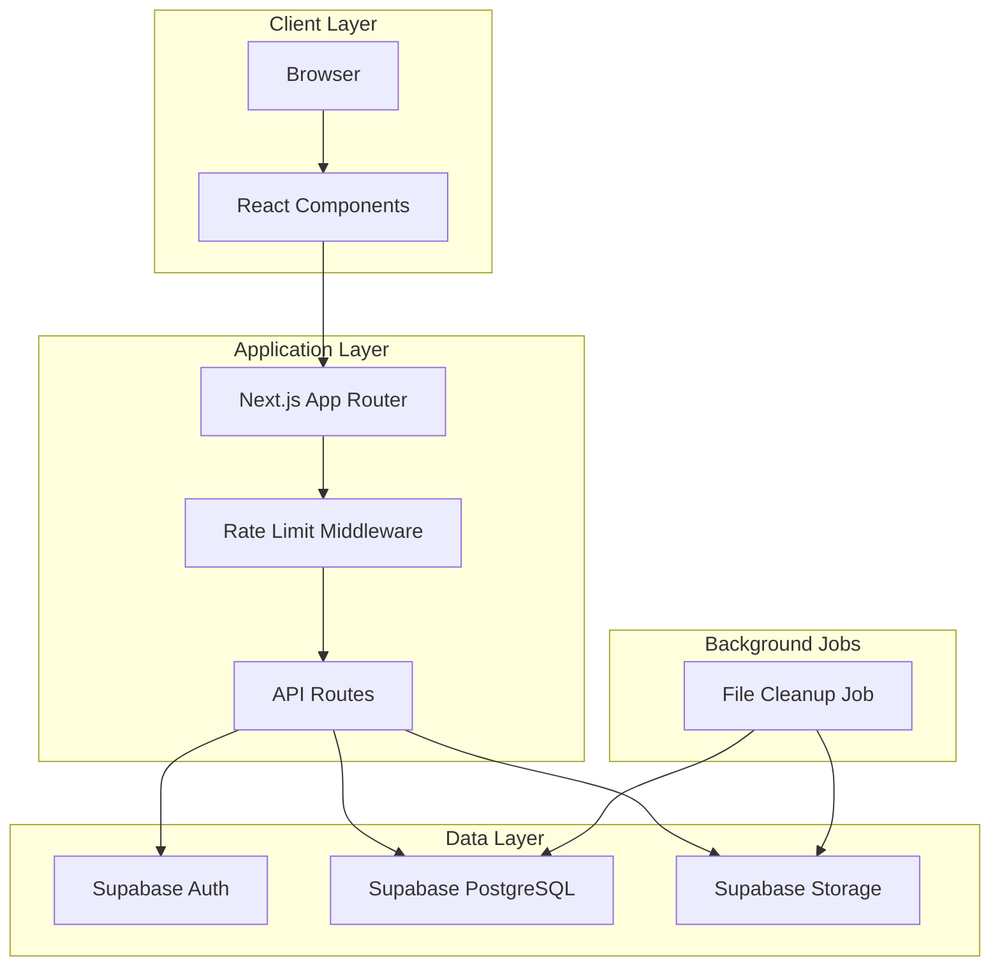
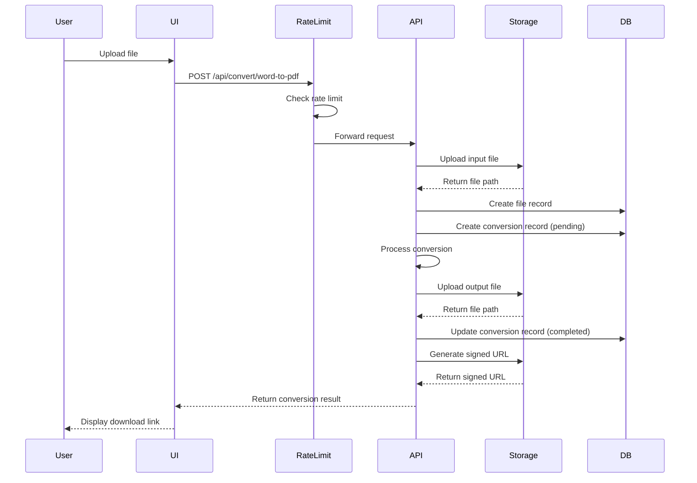
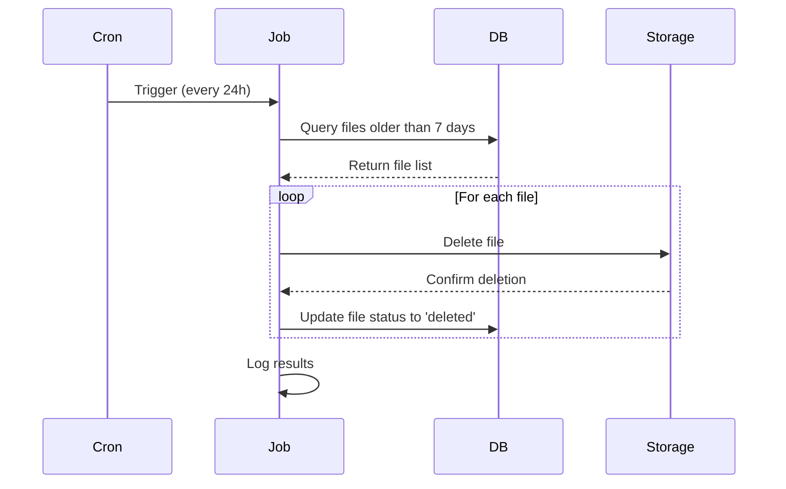

# Design Document: App Enhancements

## Overview

This design document specifies the technical implementation for enhancing the FluxConvert application with improved navigation, landing page redesign, conversion history tracking, file storage integration, rate limiting, and automated file cleanup. The enhancements transform the application from a simple conversion tool into a comprehensive document management platform with user authentication, persistent storage, and resource management.

### Goals

1. **Improve User Experience**: Redesign navigation and pages to provide a more intuitive and professional interface
2. **Enable Data Persistence**: Integrate Supabase Storage and database to track conversion history and store files
3. **Implement Resource Management**: Add rate limiting and automated file cleanup to ensure system reliability
4. **Enhance Security**: Use signed URLs for secure file downloads and implement proper access controls

### Non-Goals

1. Real-time collaboration features
2. Advanced file editing capabilities
3. Payment processing integration
4. Mobile native applications

### Technology Stack

- **Frontend**: Next.js 16.2.4 (App Router), React 19, TypeScript, Tailwind CSS
- **Backend**: Next.js API Routes (Node.js runtime)
- **Database**: Supabase PostgreSQL
- **Storage**: Supabase Storage
- **Authentication**: Supabase Auth
- **File Processing**: mammoth (Word), pdf-lib (PDF)

## Architecture

### High-Level Architecture



### Component Architecture

The application follows a layered architecture:

1. **Presentation Layer**: React components for UI rendering
2. **Application Layer**: Next.js pages and API routes for business logic
3. **Data Access Layer**: Supabase client libraries for database and storage operations
4. **Infrastructure Layer**: Middleware for cross-cutting concerns (auth, rate limiting)

### Data Flow

#### Conversion Flow (Authenticated User)



#### File Cleanup Flow



## Components and Interfaces

### Frontend Components

#### 1. Navigation Component (Updated)

**Location**: `app/layout.tsx` or shared component

**Purpose**: Provide consistent navigation across all pages

**Props**: None (uses Supabase client for auth state)

**Key Features**:
- Display Dashboard link (replaces Developer API and Pricing)
- Show user profile dropdown when authenticated
- Display Login/Sign Up buttons when unauthenticated
- Include links to Privacy, Terms, Help Center

**State Management**:
- User authentication state from Supabase
- Current route for active link highlighting

#### 2. Home Component (Redesigned)

**Location**: `src/components/home.tsx`

**Purpose**: Landing page showcasing available conversion tools

**Changes**:
- Remove file drop zone from hero section
- Display grid of conversion tool cards
- Add call-to-action buttons for each tool
- Maintain footer with static page links

**Key Features**:
- Hero section with application description
- Tool grid with icons and descriptions
- Navigation to specific conversion pages

#### 3. Dashboard Component (Redesigned)

**Location**: `app/dashboard/page.tsx`

**Purpose**: Personalized user dashboard with conversion history

**Changes**:
- Remove file drop zone
- Add personalized welcome message
- Display quick action cards for conversion tools
- Show ConversionHistory component
- Display conversion quota information

**Key Features**:
- Server-side authentication check
- Personalized greeting with user email
- Quick access to conversion tools
- Real-time quota display

#### 4. ConversionHistory Component (Enhanced)

**Location**: `src/components/dashboard/ConversionHistory.tsx`

**Purpose**: Display user's conversion history with download capabilities

**Props**: None (fetches data internally)

**Key Features**:
- Fetch conversions from database
- Display file names, types, timestamps, status
- Provide download buttons for completed conversions
- Implement pagination (50 records per page)
- Filter by conversion type
- Search by filename

**State Management**:
- Conversions list
- Loading state
- Filter and search state
- Pagination state

#### 5. Static Page Components

**Locations**:
- `app/privacy/page.tsx`
- `app/terms/page.tsx`
- `app/help-center/page.tsx`

**Purpose**: Display static content pages

**Key Features**:
- Consistent layout with navigation and footer
- Markdown or HTML content rendering
- SEO metadata

### Backend Components

#### 1. Rate Limiting Middleware

**Location**: `middleware.ts` or `src/lib/middleware/rateLimit.ts`

**Purpose**: Enforce conversion rate limits per user/IP

**Implementation Strategy**:
- Use in-memory Map for rate limit tracking (simple implementation)
- Alternative: Use Upstash Redis for distributed rate limiting (production)

**Rate Limit Rules**:
- Authenticated users: 10 conversions per hour
- Unauthenticated users: 3 conversions per hour per IP address

**Response Format**:
```typescript
{
  error: "Rate limit exceeded",
  retryAfter: 3600, // seconds until reset
  limit: 10,
  remaining: 0
}
```

**Key Features**:
- Track requests per user ID or IP address
- Reset counters after time window expires
- Return 429 status code when limit exceeded
- Include retry-after header

#### 2. Word to PDF API (Enhanced)

**Location**: `app/api/convert/word-to-pdf/route.ts`

**Purpose**: Convert Word documents to PDF with storage integration

**Enhancements**:
1. Upload input file to Supabase Storage
2. Create file record in database
3. Create conversion record (pending status)
4. Process conversion
5. Upload output file to Supabase Storage
6. Update conversion record (completed status)
7. Generate signed URL for download
8. Clean up temporary files

**Request Format**:
```typescript
POST /api/convert/word-to-pdf
Content-Type: multipart/form-data

file: File (Word document)
```

**Response Format**:
```typescript
{
  success: true,
  conversionId: string,
  fileName: string,
  fileSize: string,
  downloadUrl: string, // Signed URL
  expiresAt: string
}
```

**Error Handling**:
- File validation errors (400)
- Rate limit errors (429)
- Storage errors (500)
- Conversion errors (500)

#### 3. File Cleanup Job

**Location**: `src/lib/jobs/fileCleanup.ts`

**Purpose**: Automatically delete files older than 7 days

**Execution**: Scheduled via cron job or serverless function

**Implementation Options**:
1. **Vercel Cron Jobs**: Use Vercel's built-in cron functionality
2. **Supabase Edge Functions**: Schedule via pg_cron extension
3. **External Scheduler**: Use services like GitHub Actions or AWS EventBridge

**Process**:
1. Query files table for files older than 7 days
2. For each file:
   - Delete from Supabase Storage
   - Update file record status to 'deleted'
   - Log result
3. Generate summary report

**Configuration**:
```typescript
{
  retentionDays: 7,
  batchSize: 100,
  schedule: "0 2 * * *" // 2 AM daily
}
```

#### 4. Signed URL Generator

**Location**: `src/lib/storage/signedUrls.ts`

**Purpose**: Generate time-limited URLs for secure file downloads

**Function Signature**:
```typescript
async function generateSignedUrl(
  bucket: string,
  path: string,
  expiresIn: number = 3600
): Promise<string>
```

**Key Features**:
- Generate signed URLs with 1-hour expiration
- Support for both uploads and converted buckets
- Error handling for missing files

### Database Schema Updates

The existing schema in `supabase/schema.sql` already includes the necessary tables. We need to add one additional field:

#### Files Table Enhancement

```sql
ALTER TABLE public.files 
ADD COLUMN IF NOT EXISTS status TEXT DEFAULT 'active' 
CHECK (status IN ('active', 'deleted'));

CREATE INDEX IF NOT EXISTS idx_files_status ON public.files(status);
CREATE INDEX IF NOT EXISTS idx_files_created_at_status ON public.files(created_at DESC, status);
```

#### Rate Limiting Table (Optional - for persistent rate limiting)

```sql
CREATE TABLE IF NOT EXISTS public.rate_limits (
    id UUID PRIMARY KEY DEFAULT uuid_generate_v4(),
    identifier TEXT NOT NULL, -- user_id or IP address
    endpoint TEXT NOT NULL,
    request_count INTEGER DEFAULT 0,
    window_start TIMESTAMP WITH TIME ZONE DEFAULT NOW(),
    created_at TIMESTAMP WITH TIME ZONE DEFAULT NOW(),
    updated_at TIMESTAMP WITH TIME ZONE DEFAULT NOW(),
    
    UNIQUE(identifier, endpoint)
);

CREATE INDEX IF NOT EXISTS idx_rate_limits_identifier ON public.rate_limits(identifier);
CREATE INDEX IF NOT EXISTS idx_rate_limits_window ON public.rate_limits(window_start DESC);
```

### Storage Buckets

The following buckets need to be created in Supabase Storage:

1. **uploads**: Store uploaded input files
   - Privacy: Private
   - File size limit: 50 MB
   - Allowed MIME types: application/vnd.openxmlformats-officedocument.wordprocessingml.document, image/jpeg, image/png, application/pdf

2. **converted**: Store converted output files
   - Privacy: Private
   - File size limit: 100 MB
   - Allowed MIME types: application/pdf, application/vnd.openxmlformats-officedocument.wordprocessingml.document, image/jpeg, image/png

3. **temp**: Store temporary files during conversion (optional)
   - Privacy: Private
   - File size limit: 100 MB
   - Auto-cleanup: Enabled

### Storage Policies

```sql
-- Uploads bucket policies
CREATE POLICY "Users can upload their own files"
ON storage.objects FOR INSERT
TO authenticated
WITH CHECK (bucket_id = 'uploads' AND auth.uid()::text = (storage.foldername(name))[1]);

CREATE POLICY "Users can read their own files"
ON storage.objects FOR SELECT
TO authenticated
USING (bucket_id = 'uploads' AND auth.uid()::text = (storage.foldername(name))[1]);

-- Converted bucket policies
CREATE POLICY "Users can read their converted files"
ON storage.objects FOR SELECT
TO authenticated
USING (bucket_id = 'converted' AND auth.uid()::text = (storage.foldername(name))[1]);

CREATE POLICY "Service can write converted files"
ON storage.objects FOR INSERT
TO authenticated
WITH CHECK (bucket_id = 'converted');
```

## API Design

### Conversion API Endpoints

#### POST /api/convert/word-to-pdf

**Purpose**: Convert Word document to PDF

**Authentication**: Optional (rate limits differ)

**Request**:
```typescript
Content-Type: multipart/form-data

file: File
```

**Response (Success)**:
```typescript
{
  success: true,
  conversionId: string,
  fileName: string,
  fileSize: string,
  downloadUrl: string,
  expiresAt: string
}
```

**Response (Error)**:
```typescript
{
  error: string,
  code?: string
}
```

**Status Codes**:
- 200: Success
- 400: Invalid request (missing file, wrong format, file too large)
- 429: Rate limit exceeded
- 500: Server error

#### GET /api/conversions

**Purpose**: Fetch user's conversion history

**Authentication**: Required

**Query Parameters**:
```typescript
{
  page?: number,
  limit?: number,
  type?: string,
  status?: string,
  search?: string
}
```

**Response**:
```typescript
{
  conversions: Array<{
    id: string,
    conversionType: string,
    status: string,
    createdAt: string,
    completedAt: string | null,
    inputFile: {
      fileName: string,
      fileSize: number
    },
    outputFile: {
      fileName: string,
      fileSize: number,
      downloadUrl?: string
    } | null
  }>,
  pagination: {
    page: number,
    limit: number,
    total: number,
    totalPages: number
  }
}
```

#### GET /api/conversions/[id]/download

**Purpose**: Generate fresh signed URL for downloading converted file

**Authentication**: Required

**Response**:
```typescript
{
  downloadUrl: string,
  expiresAt: string
}
```

**Status Codes**:
- 200: Success
- 401: Unauthorized
- 404: Conversion not found or file deleted
- 500: Server error

#### GET /api/quota

**Purpose**: Get user's current rate limit status

**Authentication**: Required

**Response**:
```typescript
{
  limit: number,
  used: number,
  remaining: number,
  resetAt: string
}
```

### Internal API Functions

#### Storage Operations

```typescript
// Upload file to Supabase Storage
async function uploadFile(
  bucket: string,
  path: string,
  file: File | Buffer,
  options?: { contentType?: string }
): Promise<{ path: string; error?: Error }>

// Delete file from Supabase Storage
async function deleteFile(
  bucket: string,
  path: string
): Promise<{ success: boolean; error?: Error }>

// Generate signed URL
async function getSignedUrl(
  bucket: string,
  path: string,
  expiresIn?: number
): Promise<{ url: string; error?: Error }>
```

#### Database Operations

```typescript
// Create file record
async function createFileRecord(data: {
  userId: string | null,
  fileName: string,
  fileType: string,
  fileSize: number,
  storagePath: string,
  storageBucket: string
}): Promise<{ id: string; error?: Error }>

// Create conversion record
async function createConversionRecord(data: {
  userId: string | null,
  inputFileId: string,
  outputFileId: string | null,
  conversionType: string,
  status: string
}): Promise<{ id: string; error?: Error }>

// Update conversion status
async function updateConversionStatus(
  conversionId: string,
  status: string,
  errorMessage?: string
): Promise<{ success: boolean; error?: Error }>

// Fetch user conversions
async function getUserConversions(
  userId: string,
  options: {
    page: number,
    limit: number,
    type?: string,
    status?: string,
    search?: string
  }
): Promise<{ conversions: Conversion[]; total: number; error?: Error }>
```

## Data Models

### File Model

```typescript
interface File {
  id: string;
  userId: string | null;
  fileName: string;
  fileType: string;
  fileSize: number;
  storagePath: string;
  storageBucket: string;
  status: 'active' | 'deleted';
  createdAt: string;
}
```

### Conversion Model

```typescript
interface Conversion {
  id: string;
  userId: string | null;
  inputFileId: string;
  outputFileId: string | null;
  conversionType: string;
  status: 'pending' | 'processing' | 'completed' | 'failed';
  errorMessage: string | null;
  createdAt: string;
  completedAt: string | null;
}
```

### Rate Limit Model

```typescript
interface RateLimit {
  identifier: string; // user ID or IP address
  endpoint: string;
  requestCount: number;
  windowStart: Date;
  limit: number;
}
```

## Error Handling

### Error Categories

1. **Validation Errors** (400)
   - Missing required fields
   - Invalid file format
   - File size exceeds limit
   - Invalid parameters

2. **Authentication Errors** (401)
   - Missing authentication token
   - Invalid or expired token

3. **Authorization Errors** (403)
   - User doesn't own the resource
   - Insufficient permissions

4. **Rate Limit Errors** (429)
   - Too many requests
   - Quota exceeded

5. **Not Found Errors** (404)
   - Resource doesn't exist
   - File has been deleted

6. **Server Errors** (500)
   - Storage upload/download failures
   - Database connection errors
   - Conversion processing errors
   - Unexpected exceptions

### Error Response Format

```typescript
interface ErrorResponse {
  error: string;
  code?: string;
  details?: Record<string, any>;
  retryAfter?: number; // For rate limit errors
}
```

### Error Handling Strategy

1. **API Routes**: Use try-catch blocks and return appropriate HTTP status codes
2. **Frontend**: Display user-friendly error messages with retry options
3. **Logging**: Log all errors with context for debugging
4. **Monitoring**: Track error rates and patterns

### Temporary File Cleanup

All temporary files created during conversion must be cleaned up:

```typescript
async function cleanupTempFiles(files: string[]): Promise<void> {
  for (const file of files) {
    try {
      await fs.unlink(file);
    } catch (error) {
      console.error(`Failed to delete temp file ${file}:`, error);
      // Continue with other files
    }
  }
}
```

**Cleanup Triggers**:
- After successful conversion
- After failed conversion
- In finally block to ensure cleanup

## Testing Strategy

### Testing Approach

This feature involves UI components, database integration, file storage, and background jobs. The testing strategy focuses on:

1. **Unit Tests**: Test individual functions and components in isolation
2. **Integration Tests**: Test API endpoints with database and storage
3. **End-to-End Tests**: Test complete user workflows
4. **Manual Testing**: Verify UI/UX and edge cases

Property-based testing is **not applicable** for this feature because:
- Most functionality involves UI rendering and user interactions
- Database and storage operations are integration points, not pure functions
- File conversion relies on external libraries (mammoth, pdf-lib)
- Background jobs involve scheduled tasks and side effects

### Unit Tests

**Components to Test**:

1. **Navigation Component**
   - Renders correct links based on auth state
   - Displays user profile when authenticated
   - Shows login/signup buttons when unauthenticated

2. **ConversionHistory Component**
   - Renders empty state when no conversions
   - Displays conversion records correctly
   - Filters and search work as expected
   - Pagination controls function properly

3. **Rate Limit Logic**
   - Correctly tracks request counts
   - Resets counters after time window
   - Differentiates between authenticated and unauthenticated users

4. **File Cleanup Logic**
   - Identifies files older than retention period
   - Handles deletion errors gracefully
   - Logs results correctly

**Test Framework**: Jest with React Testing Library

**Example Test**:
```typescript
describe('ConversionHistory', () => {
  it('should display empty state when no conversions exist', () => {
    render(<ConversionHistory />);
    expect(screen.getByText(/no conversions yet/i)).toBeInTheDocument();
  });

  it('should display conversion records', async () => {
    const mockConversions = [
      { id: '1', conversionType: 'word-to-pdf', status: 'completed', ... }
    ];
    mockSupabaseQuery.mockResolvedValue({ data: mockConversions });
    
    render(<ConversionHistory />);
    await waitFor(() => {
      expect(screen.getByText('Word to PDF')).toBeInTheDocument();
    });
  });
});
```

### Integration Tests

**API Endpoints to Test**:

1. **POST /api/convert/word-to-pdf**
   - Successful conversion flow
   - File validation (format, size)
   - Rate limiting enforcement
   - Database record creation
   - Storage upload/download
   - Temporary file cleanup

2. **GET /api/conversions**
   - Fetch user conversions
   - Pagination
   - Filtering by type and status
   - Search functionality

3. **GET /api/conversions/[id]/download**
   - Generate signed URL
   - Authorization checks
   - Handle deleted files

**Test Framework**: Jest with Supertest

**Example Test**:
```typescript
describe('POST /api/convert/word-to-pdf', () => {
  it('should convert word document and create database records', async () => {
    const response = await request(app)
      .post('/api/convert/word-to-pdf')
      .attach('file', 'test-fixtures/sample.docx')
      .set('Authorization', `Bearer ${authToken}`);
    
    expect(response.status).toBe(200);
    expect(response.body.success).toBe(true);
    expect(response.body.downloadUrl).toBeDefined();
    
    // Verify database records
    const conversion = await db.conversions.findById(response.body.conversionId);
    expect(conversion.status).toBe('completed');
  });

  it('should enforce rate limits', async () => {
    // Make 10 requests (limit)
    for (let i = 0; i < 10; i++) {
      await request(app)
        .post('/api/convert/word-to-pdf')
        .attach('file', 'test-fixtures/sample.docx')
        .set('Authorization', `Bearer ${authToken}`);
    }
    
    // 11th request should fail
    const response = await request(app)
      .post('/api/convert/word-to-pdf')
      .attach('file', 'test-fixtures/sample.docx')
      .set('Authorization', `Bearer ${authToken}`);
    
    expect(response.status).toBe(429);
    expect(response.body.error).toContain('Rate limit exceeded');
  });
});
```

### End-to-End Tests

**User Workflows to Test**:

1. **Conversion Flow**
   - User uploads file
   - Conversion completes
   - User downloads converted file
   - Conversion appears in history

2. **Dashboard Flow**
   - User logs in
   - Dashboard displays welcome message
   - Quick actions are clickable
   - Conversion history loads

3. **Rate Limit Flow**
   - User performs multiple conversions
   - Quota display updates
   - Rate limit message appears when exceeded

**Test Framework**: Playwright or Cypress

**Example Test**:
```typescript
test('user can convert word to pdf and download result', async ({ page }) => {
  await page.goto('/login');
  await page.fill('[name="email"]', 'test@example.com');
  await page.fill('[name="password"]', 'password');
  await page.click('button[type="submit"]');
  
  await page.goto('/word-to-pdf');
  await page.setInputFiles('input[type="file"]', 'test-fixtures/sample.docx');
  await page.click('button:has-text("Convert")');
  
  await page.waitForSelector('text=Conversion complete');
  await page.click('button:has-text("Download")');
  
  // Verify download started
  const download = await page.waitForEvent('download');
  expect(download.suggestedFilename()).toContain('.pdf');
});
```

### Manual Testing Checklist

- [ ] Navigation links work correctly
- [ ] Home page displays tool grid
- [ ] Dashboard shows personalized welcome
- [ ] Conversion history displays correctly
- [ ] File upload and conversion work
- [ ] Download links function properly
- [ ] Rate limiting prevents excessive requests
- [ ] Quota display updates in real-time
- [ ] Static pages render correctly
- [ ] Mobile responsive design works
- [ ] Error messages are user-friendly
- [ ] Loading states display appropriately

### Test Coverage Goals

- Unit tests: 80% code coverage
- Integration tests: All API endpoints
- E2E tests: Critical user workflows
- Manual testing: UI/UX verification

## Implementation Approach

### Phase 1: Navigation and UI Updates (Requirements 1-4)

**Tasks**:
1. Update navigation component to remove Developer API and Pricing links
2. Add Dashboard link to navigation
3. Redesign home page to remove file drop zone and add tool grid
4. Redesign dashboard page to remove file drop zone and add quick actions
5. Create/update static pages (Privacy, Terms, Help Center)
6. Add footer links to static pages

**Estimated Effort**: 2-3 days

**Dependencies**: None

### Phase 2: Database and Storage Integration (Requirements 5-7)

**Tasks**:
1. Add status field to files table
2. Create storage buckets in Supabase
3. Configure storage policies
4. Update Word to PDF API to upload files to storage
5. Implement file record creation in database
6. Implement conversion record creation and updates
7. Implement signed URL generation
8. Update API response to include signed URLs

**Estimated Effort**: 3-4 days

**Dependencies**: Phase 1 (for testing)

### Phase 3: Rate Limiting (Requirements 8-9)

**Tasks**:
1. Implement rate limiting middleware
2. Add rate limit tracking (in-memory or database)
3. Integrate middleware with conversion API
4. Create quota API endpoint
5. Update dashboard to display quota information
6. Add rate limit error handling in UI

**Estimated Effort**: 2-3 days

**Dependencies**: Phase 2

### Phase 4: File Cleanup (Requirements 10-11)

**Tasks**:
1. Implement file cleanup job logic
2. Set up cron job or scheduled function
3. Implement temporary file cleanup in conversion API
4. Add logging for cleanup operations
5. Test cleanup job with old files

**Estimated Effort**: 2-3 days

**Dependencies**: Phase 2

### Phase 5: Conversion History (Requirement 12)

**Tasks**:
1. Enhance ConversionHistory component with pagination
2. Implement filtering and search
3. Add download functionality with signed URL regeneration
4. Create conversions API endpoint
5. Add loading and error states
6. Test with large datasets

**Estimated Effort**: 2-3 days

**Dependencies**: Phase 2

### Phase 6: Testing and Polish

**Tasks**:
1. Write unit tests for components and utilities
2. Write integration tests for API endpoints
3. Write E2E tests for critical workflows
4. Perform manual testing
5. Fix bugs and polish UI
6. Update documentation

**Estimated Effort**: 3-4 days

**Dependencies**: All previous phases

### Total Estimated Effort: 14-20 days

### Deployment Considerations

1. **Environment Variables**:
   - `NEXT_PUBLIC_SUPABASE_URL`
   - `NEXT_PUBLIC_SUPABASE_ANON_KEY`
   - `SUPABASE_SERVICE_ROLE_KEY` (for admin operations)

2. **Database Migrations**:
   - Run schema updates before deployment
   - Create storage buckets
   - Configure storage policies

3. **Cron Job Setup**:
   - Configure Vercel Cron or alternative scheduler
   - Set up monitoring and alerts

4. **Monitoring**:
   - Track API error rates
   - Monitor storage usage
   - Track rate limit violations
   - Monitor cleanup job execution

5. **Rollback Plan**:
   - Keep previous version deployed
   - Database migrations should be backward compatible
   - Feature flags for gradual rollout

## Security Considerations

1. **Authentication**: All sensitive operations require authentication
2. **Authorization**: Users can only access their own files and conversions
3. **File Validation**: Strict validation of file types and sizes
4. **Signed URLs**: Time-limited access to files
5. **Rate Limiting**: Prevent abuse and ensure fair usage
6. **SQL Injection**: Use parameterized queries (Supabase handles this)
7. **XSS Protection**: Sanitize user inputs and file names
8. **CORS**: Configure appropriate CORS policies
9. **Environment Variables**: Never expose service role keys to client

## Performance Considerations

1. **Database Indexing**: Indexes on user_id, created_at, status for fast queries
2. **Pagination**: Limit query results to prevent large data transfers
3. **Caching**: Cache static content and user sessions
4. **File Size Limits**: Enforce 50 MB limit to prevent resource exhaustion
5. **Concurrent Conversions**: Limit concurrent conversions per user
6. **Storage Optimization**: Compress files when possible
7. **CDN**: Use CDN for static assets
8. **Database Connection Pooling**: Reuse database connections

## Monitoring and Observability

1. **Metrics to Track**:
   - Conversion success/failure rates
   - API response times
   - Storage usage
   - Rate limit violations
   - Cleanup job execution
   - Error rates by endpoint

2. **Logging**:
   - API requests and responses
   - Conversion operations
   - File cleanup operations
   - Error stack traces

3. **Alerts**:
   - High error rates
   - Storage approaching limits
   - Cleanup job failures
   - Unusual rate limit patterns

## Future Enhancements

1. **Batch Conversions**: Allow multiple file uploads
2. **Conversion Presets**: Save user preferences
3. **Sharing**: Share converted files with others
4. **Advanced Formatting**: Preserve complex Word formatting
5. **OCR Support**: Extract text from images
6. **Webhooks**: Notify users when conversions complete
7. **API Access**: Provide REST API for developers
8. **Analytics Dashboard**: Track usage statistics
