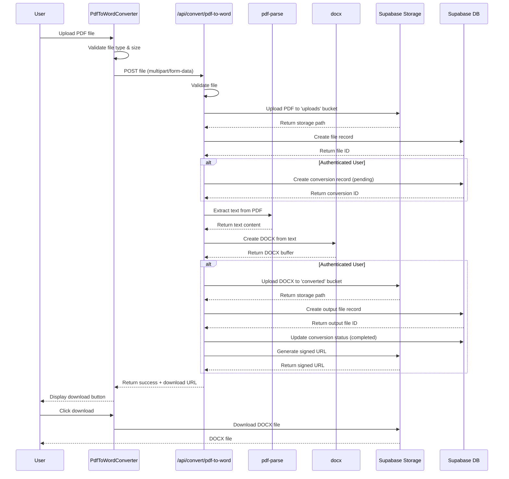

# Design Document: PDF to Word Converter

## Overview

The PDF to Word Converter feature enables users to convert PDF files to Microsoft Word (.docx) format through a web-based interface. This feature mirrors the existing Word to PDF conversion functionality, providing reverse conversion capability while maintaining consistency with the application's architecture, user experience patterns, and infrastructure.

### Design Goals

1. **Consistency**: Mirror the existing Word to PDF converter in terms of UI/UX, API structure, and code organization
2. **Content Preservation**: Extract and preserve text content, paragraph structure, and basic formatting from PDF files
3. **Reliability**: Handle various PDF structures gracefully with appropriate error handling
4. **Performance**: Process conversions efficiently within the 50MB file size limit
5. **Scalability**: Leverage existing Supabase infrastructure for storage and database operations
6. **Maintainability**: Follow established patterns and conventions from the existing codebase

### Key Design Decisions

| Decision Area | Choice | Rationale |
|--------------|--------|-----------|
| PDF Parsing Library | `pdf-parse` | Pure JavaScript, no OS dependencies, simple API for text extraction, widely used (500K+ weekly downloads) |
| DOCX Generation Library | `docx` | Most popular DOCX library (1M+ weekly downloads), declarative API, actively maintained, TypeScript support |
| API Endpoint Pattern | `/api/convert/pdf-to-word/route.ts` | Follows existing convention established by `/api/convert/word-to-pdf/route.ts` |
| Component Structure | `PdfToWordConverter.tsx` | Mirrors `WordToPdfConverter.tsx` for consistency |
| Database Schema | Reuse existing `files` and `conversions` tables | No schema changes needed, conversion_type distinguishes feature |
| Storage Buckets | Reuse existing `uploads` and `converted` buckets | Existing infrastructure supports all file types |

## Architecture

### High-Level Architecture

```
┌─────────────────────────────────────────────────────────────────┐
│                         Client Layer                             │
│  ┌──────────────────────────────────────────────────────────┐  │
│  │  PdfToWordConverter Component (React)                     │  │
│  │  - File upload (drag & drop, click to browse)            │  │
│  │  - Progress tracking                                      │  │
│  │  - Download management                                    │  │
│  └──────────────────────────────────────────────────────────┘  │
└─────────────────────────────────────────────────────────────────┘
                              │
                              │ HTTP POST /api/convert/pdf-to-word
                              ▼
┌─────────────────────────────────────────────────────────────────┐
│                         API Layer                                │
│  ┌──────────────────────────────────────────────────────────┐  │
│  │  PDF to Word Conversion API (Next.js Route Handler)      │  │
│  │  1. Validate file (type, size)                           │  │
│  │  2. Upload to storage                                    │  │
│  │  3. Create file & conversion records                     │  │
│  │  4. Parse PDF → Extract text                             │  │
│  │  5. Generate DOCX → Create Word document                 │  │
│  │  6. Upload converted file                                │  │
│  │  7. Update conversion status                             │  │
│  │  8. Return download URL                                  │  │
│  └──────────────────────────────────────────────────────────┘  │
└─────────────────────────────────────────────────────────────────┘
                              │
                              ▼
┌─────────────────────────────────────────────────────────────────┐
│                      Service Layer                               │
│  ┌──────────────┐  ┌──────────────┐  ┌──────────────────────┐ │
│  │  pdf-parse   │  │    docx      │  │  Storage Operations  │ │
│  │  (Extract    │  │  (Generate   │  │  (Upload/Download)   │ │
│  │   text)      │  │   DOCX)      │  │                      │ │
│  └──────────────┘  └──────────────┘  └──────────────────────┘ │
│  ┌──────────────┐  ┌──────────────┐  ┌──────────────────────┐ │
│  │  Database    │  │  Signed URLs │  │  Authentication      │ │
│  │  Operations  │  │  Generation  │  │  (Supabase Auth)     │ │
│  └──────────────┘  └──────────────┘  └──────────────────────┘ │
└─────────────────────────────────────────────────────────────────┘
                              │
                              ▼
┌─────────────────────────────────────────────────────────────────┐
│                    Infrastructure Layer                          │
│  ┌──────────────────────┐  ┌──────────────────────────────┐   │
│  │  Supabase Storage    │  │  Supabase PostgreSQL         │   │
│  │  - uploads bucket    │  │  - files table               │   │
│  │  - converted bucket  │  │  - conversions table         │   │
│  └──────────────────────┘  └──────────────────────────────┘   │
└─────────────────────────────────────────────────────────────────┘
```

### Conversion Flow Diagram



## Components and Interfaces

### Frontend Component

#### PdfToWordConverter Component

**Location**: `src/components/converters/PdfToWordConverter.tsx`

**Purpose**: Provides the user interface for PDF to Word conversion with file upload, progress tracking, and download functionality.

**Key Features**:
- Drag-and-drop file upload with visual feedback
- File type validation (.pdf only)
- File size validation (50MB limit)
- Real-time conversion progress display
- Download button for converted files
- Error message display
- Authentication-aware UI (shows user profile or login/signup buttons)

**State Management**:
```typescript
interface UploadedFile {
  file: File;
  preview?: string;
  id: string;
}

interface ConversionStatus {
  status: 'idle' | 'uploading' | 'converting' | 'completed' | 'error';
  progress: number;
  message: string;
  downloadUrl?: string;
  convertedFileName?: string;
  convertedFileSize?: string;
}
```

**Dependencies**:
- `react-dropzone`: File upload handling
- `framer-motion`: Animations and transitions
- `@/src/lib/supabase/client`: Authentication state management

**UI Flow**:
1. **Initial State**: Display upload area with drag-and-drop zone
2. **File Selected**: Show file preview with name and size
3. **Converting**: Display progress bar (0% → 30% upload, 30% → 60% conversion, 60% → 100% complete)
4. **Completed**: Show download button and "Convert Another" option
5. **Error**: Display error message with retry option

### Backend API

#### PDF to Word Conversion API

**Location**: `app/api/convert/pdf-to-word/route.ts`

**Runtime Configuration**:
```typescript
export const runtime = 'nodejs';
export const dynamic = 'force-dynamic';
```

**Request Interface**:
```typescript
// HTTP POST with multipart/form-data
FormData {
  file: File  // PDF file (.pdf extension, max 50MB)
}
```

**Response Interface**:
```typescript
// Success Response
{
  success: true,
  fileName: string,        // e.g., "document.docx"
  fileSize: string,        // e.g., "1.2 MB"
  downloadUrl: string,     // Signed URL or base64 data URL
  expiresAt?: string       // ISO 8601 timestamp (authenticated users only)
}

// Error Response
{
  error: string            // Descriptive error message
}
```

**Processing Pipeline**:

1. **Authentication Check**
   ```typescript
   const supabase = await createClient();
   const { data: { user } } = await supabase.auth.getUser();
   const userId = user?.id || null;
   ```

2. **File Validation**
   - Check file exists
   - Validate `.pdf` extension
   - Validate size ≤ 50MB

3. **Storage Upload** (Input File)
   - Generate storage path: `{userId}/{timestamp}-{sanitized_filename}`
   - Upload to `uploads` bucket
   - Create file record in database

4. **Conversion Record Creation** (Authenticated users only)
   - Create conversion record with status `pending`
   - Store conversion_type as `pdf-to-word`

5. **PDF Parsing**
   ```typescript
   import pdfParse from 'pdf-parse';
   
   const pdfData = await pdfParse(buffer);
   const textContent = pdfData.text;
   ```

6. **DOCX Generation**
   ```typescript
   import { Document, Paragraph, TextRun, Packer } from 'docx';
   
   // Split text into paragraphs
   const paragraphs = textContent.split('\n\n').map(text => 
     new Paragraph({
       children: [new TextRun(text)]
     })
   );
   
   // Create document
   const doc = new Document({
     sections: [{
       properties: {},
       children: paragraphs
     }]
   });
   
   // Generate buffer
   const docxBuffer = await Packer.toBuffer(doc);
   ```

7. **Storage Upload** (Output File - Authenticated users only)
   - Upload DOCX to `converted` bucket
   - Create output file record
   - Update conversion status to `completed`

8. **Response Generation**
   - Authenticated users: Generate signed URL (1 hour expiration)
   - Anonymous users: Return base64-encoded data URL
   - Include file metadata (name, size)

**Error Handling**:
- No file provided → 400 Bad Request
- Invalid file type → 400 Bad Request
- File size exceeded → 400 Bad Request
- Storage upload failure → 500 Internal Server Error
- Database operation failure → 500 Internal Server Error
- PDF parsing failure → 500 Internal Server Error
- DOCX generation failure → 500 Internal Server Error

### Page Component

#### PDF to Word Converter Page

**Location**: `app/pdf-to-word/page.tsx`

**Purpose**: Server component that renders the PDF to Word converter page.

**Implementation**:
```typescript
import PdfToWordConverter from '@/src/components/converters/PdfToWordConverter';

export default function PdfToWordPage() {
  return <PdfToWordConverter />;
}

export const metadata = {
  title: 'PDF to Word Converter | FluxConvert',
  description: 'Convert PDF files to Word documents (.docx) quickly and easily. Maintain formatting and layout.',
};
```

## Data Models

### Existing Database Schema (Reused)

The PDF to Word converter reuses the existing database schema without modifications. The `conversion_type` field distinguishes this feature from others.

#### Files Table

```sql
CREATE TABLE IF NOT EXISTS public.files (
    id UUID PRIMARY KEY DEFAULT uuid_generate_v4(),
    user_id UUID REFERENCES auth.users(id) ON DELETE CASCADE,
    
    file_name TEXT NOT NULL,
    file_type TEXT NOT NULL,
    file_size BIGINT NOT NULL,
    
    storage_path TEXT NOT NULL,
    storage_bucket TEXT NOT NULL,
    
    status TEXT DEFAULT 'active' CHECK (status IN ('active', 'deleted')),
    
    created_at TIMESTAMP WITH TIME ZONE DEFAULT NOW()
);
```

**Usage for PDF to Word**:
- Input file: `file_type = 'application/pdf'`, `storage_bucket = 'uploads'`
- Output file: `file_type = 'application/vnd.openxmlformats-officedocument.wordprocessingml.document'`, `storage_bucket = 'converted'`

#### Conversions Table

```sql
CREATE TABLE IF NOT EXISTS public.conversions (
    id UUID PRIMARY KEY DEFAULT uuid_generate_v4(),
    
    user_id UUID REFERENCES auth.users(id) ON DELETE CASCADE,
    
    input_file_id UUID REFERENCES public.files(id) ON DELETE SET NULL,
    output_file_id UUID REFERENCES public.files(id) ON DELETE SET NULL,
    
    conversion_type TEXT NOT NULL,
    
    status TEXT DEFAULT 'pending' CHECK (status IN ('pending', 'processing', 'completed', 'failed')),
    error_message TEXT,
    
    created_at TIMESTAMP WITH TIME ZONE DEFAULT NOW(),
    completed_at TIMESTAMP WITH TIME ZONE
);
```

**Usage for PDF to Word**:
- `conversion_type = 'pdf-to-word'`
- Status progression: `pending` → `completed` or `failed`
- Only created for authenticated users

### Storage Path Patterns

**Authenticated Users**:
- Input: `uploads/{user_id}/{timestamp}-{sanitized_filename}.pdf`
- Output: `converted/{user_id}/{timestamp}-{sanitized_filename}.docx`

**Anonymous Users**:
- Input: `uploads/anonymous/{timestamp}-{sanitized_filename}.pdf`
- Output: Not stored (returned as base64 data URL)

**Filename Sanitization**:
```typescript
const sanitizedFileName = fileName.replace(/[^a-zA-Z0-9.-]/g, '_');
```

### API Data Flow

**Request Flow**:
```
User → FormData(file) → API Handler → Validation → Storage → Database → Conversion → Response
```

**Data Transformations**:
1. **File → Buffer**: `Buffer.from(await file.arrayBuffer())`
2. **Buffer → PDF Text**: `pdfParse(buffer).text`
3. **Text → Paragraphs**: `text.split('\n\n')`
4. **Paragraphs → DOCX**: `docx` library Document/Paragraph/TextRun
5. **DOCX → Buffer**: `Packer.toBuffer(doc)`
6. **Buffer → Storage**: Upload to Supabase Storage
7. **Storage Path → Signed URL**: `generateSignedUrl(bucket, path, 3600)`

## Correctness Properties

*A property is a characteristic or behavior that should hold true across all valid executions of a system—essentially, a formal statement about what the system should do. Properties serve as the bridge between human-readable specifications and machine-verifiable correctness guarantees.*

Before defining correctness properties, I need to analyze the acceptance criteria from the requirements document to determine which are suitable for property-based testing.


### Property Reflection

After analyzing all acceptance criteria, I've identified the following redundancies and consolidation opportunities:

**Redundancy Analysis**:

1. **Text Extraction Properties (3.1, 15.1, 15.2, 15.3)**: These all test that text is extracted from PDFs. Properties 15.2 and 15.3 (character count > 0, word count > 0) are implied by 15.1 (document contains extracted text). We can consolidate into a single comprehensive property.

2. **File Extension Properties (15.5, 15.6, 18.2)**: All three test that output files have .docx extension. Property 15.6 is a specific example of the general rule. We can consolidate into one property about extension transformation.

3. **Response Structure Properties (18.1, 18.2, 18.3, 18.4)**: These all test successful response structure. We can combine into one property that validates the complete response structure.

4. **Database Integrity Properties (16.1, 16.2)**: Both test that file records exist. We can combine into one property about file record creation for both input and output.

5. **Storage Path Properties (17.1, 17.2)**: Both test path patterns, just for different user types. We can combine into one property that handles both cases.

**Consolidated Properties**:
After reflection, we'll define 12 core properties that provide comprehensive coverage without redundancy:

1. Text content preservation (consolidates 3.1, 3.4, 15.1, 15.2, 15.3)
2. Paragraph structure preservation (3.5)
3. Valid DOCX generation (3.3, 15.4)
4. File extension transformation (consolidates 15.5, 15.6, 18.2)
5. Error handling (3.7, 18.5)
6. Successful response structure (consolidates 18.1, 18.3, 18.4)
7. File record creation (consolidates 16.1, 16.2)
8. Conversion record integrity (consolidates 16.3, 16.6)
9. Timestamp ordering (16.4)
10. Error message presence (16.5)
11. Storage path patterns (consolidates 17.1, 17.2, 17.3, 17.4, 17.5)
12. Authenticated user response metadata (18.6)

### Property 1: Text Content Preservation

*For any* valid PDF file containing text content, when converted to DOCX format, the generated Word document SHALL contain the extracted text with character count and word count greater than zero.

**Validates: Requirements 3.1, 3.4, 15.1, 15.2, 15.3**

### Property 2: Paragraph Structure Preservation

*For any* PDF file with identifiable paragraph boundaries, the conversion process SHALL preserve the paragraph structure in the generated DOCX document, maintaining the same number of paragraph breaks.

**Validates: Requirements 3.5**

### Property 3: Valid DOCX Generation

*For any* valid PDF input file, the conversion process SHALL generate a valid DOCX file with size greater than zero bytes that can be opened by Word-compatible applications.

**Validates: Requirements 3.3, 15.4**

### Property 4: File Extension Transformation

*For any* input file with name pattern `{basename}.pdf`, the output file SHALL have name pattern `{basename}.docx`, correctly replacing the .pdf extension with .docx.

**Validates: Requirements 15.5, 15.6, 18.2**

### Property 5: Error Handling

*For any* invalid or corrupted PDF input, the conversion API SHALL return an error response containing a non-empty, descriptive error message rather than succeeding or failing silently.

**Validates: Requirements 3.7, 18.5**

### Property 6: Successful Response Structure

*For any* successful conversion, the API response SHALL contain all required fields: `success` (true), `fileName` (string ending in .docx), `fileSize` (non-empty string), and `downloadUrl` (non-empty string).

**Validates: Requirements 18.1, 18.2, 18.3, 18.4**

### Property 7: File Record Creation

*For any* authenticated user conversion, the system SHALL create exactly two file records in the database: one for the input PDF file in the "uploads" bucket and one for the output DOCX file in the "converted" bucket.

**Validates: Requirements 16.1, 16.2**

### Property 8: Conversion Record Integrity

*For any* authenticated user conversion, a conversion record SHALL exist with status in the set {pending, processing, completed, failed}, and if status is "completed", the output_file_id SHALL reference a valid file record.

**Validates: Requirements 16.3, 16.6**

### Property 9: Timestamp Ordering

*For any* completed conversion record, the completed_at timestamp SHALL be strictly greater than the created_at timestamp, ensuring temporal consistency.

**Validates: Requirements 16.4**

### Property 10: Error Message Presence

*For any* conversion record with status "failed", the error_message field SHALL contain a non-empty string describing the failure reason.

**Validates: Requirements 16.5**

### Property 11: Storage Path Patterns

*For any* file upload, the storage path SHALL match the pattern `{user_id}/{timestamp}-{sanitized_filename}` for authenticated users or `anonymous/{timestamp}-{sanitized_filename}` for anonymous users, where sanitized_filename contains only alphanumeric characters, dots, hyphens, and underscores, timestamp is a positive integer, and storage_bucket is either "uploads" or "converted".

**Validates: Requirements 17.1, 17.2, 17.3, 17.4, 17.5**

### Property 12: Authenticated User Response Metadata

*For any* authenticated user conversion that generates a signed URL, the API response SHALL include an `expiresAt` field containing a valid ISO 8601 timestamp indicating when the signed URL expires.

**Validates: Requirements 18.6**

## Error Handling

### Error Categories

The PDF to Word converter implements comprehensive error handling across multiple layers:

#### 1. Client-Side Validation Errors

**File Type Validation**:
- **Trigger**: User uploads non-PDF file
- **Detection**: File extension check in `react-dropzone` accept configuration
- **Response**: Display error message "Only .pdf files are supported"
- **User Action**: Select a different file

**File Size Validation**:
- **Trigger**: User uploads file > 50MB
- **Detection**: `maxSize` configuration in `react-dropzone`
- **Response**: Display error message "File size exceeds 50 MB limit"
- **User Action**: Compress PDF or select smaller file

**No File Selected**:
- **Trigger**: User clicks convert without selecting file
- **Detection**: Check `uploadedFiles.length === 0` before API call
- **Response**: Display error message "Please upload a file first"
- **User Action**: Select a file

#### 2. API Validation Errors (HTTP 400)

**Missing File**:
```typescript
if (!file) {
  return NextResponse.json(
    { error: 'No file provided' },
    { status: 400 }
  );
}
```

**Invalid File Type**:
```typescript
if (!file.name.endsWith('.pdf')) {
  return NextResponse.json(
    { error: 'Only .pdf files are supported' },
    { status: 400 }
  );
}
```

**File Size Exceeded**:
```typescript
if (file.size > MAX_FILE_SIZE) {
  return NextResponse.json(
    { error: 'File size exceeds 50 MB limit' },
    { status: 400 }
  );
}
```

#### 3. Infrastructure Errors (HTTP 500)

**Storage Upload Failure**:
- **Trigger**: Supabase Storage API error
- **Detection**: Check `uploadResult.error`
- **Response**: `{ error: 'Failed to upload file to storage' }`
- **Logging**: Log full error details to console
- **Recovery**: User can retry upload

**Database Operation Failure**:
- **Trigger**: Database constraint violation, connection error
- **Detection**: Check error from `createFileRecord` or `createConversionRecord`
- **Response**: `{ error: 'Failed to create file record in database' }`
- **Logging**: Log full error details to console
- **Recovery**: User can retry conversion

#### 4. Conversion Errors (HTTP 500)

**PDF Parsing Failure**:
- **Trigger**: Corrupted PDF, encrypted PDF, unsupported PDF version
- **Detection**: `pdf-parse` throws exception
- **Response**: `{ error: 'Failed to parse PDF: [specific error]' }`
- **Logging**: Log PDF parsing error details
- **Recovery**: User should try different PDF file

**DOCX Generation Failure**:
- **Trigger**: Invalid text content, memory exhaustion
- **Detection**: `docx` library throws exception
- **Response**: `{ error: 'Failed to generate Word document: [specific error]' }`
- **Logging**: Log DOCX generation error details
- **Recovery**: User can retry with smaller file

**Empty Content**:
- **Trigger**: PDF contains no extractable text
- **Detection**: Check if `pdfData.text.trim().length === 0`
- **Response**: `{ error: 'PDF contains no extractable text content' }`
- **User Action**: Verify PDF contains text (not just images)

#### 5. Download Errors

**Signed URL Generation Failure**:
- **Trigger**: Storage API error, invalid path
- **Detection**: Check `signedUrlResult.error`
- **Fallback**: Return base64-encoded data URL instead
- **Logging**: Log signed URL generation error
- **Impact**: User can still download, but URL doesn't expire

**Network Error During Download**:
- **Trigger**: Network interruption, browser cancellation
- **Detection**: Browser handles automatically
- **Recovery**: User can click download button again

### Error Handling Strategy

**Graceful Degradation**:
1. **Signed URL Failure**: Fall back to base64 data URL
2. **Conversion Record Failure**: Continue conversion for anonymous users
3. **Output Storage Failure**: Return file directly without storing

**User Communication**:
- All errors display in red alert box with error icon
- Error messages are descriptive and actionable
- Technical details logged to console for debugging
- User always has option to retry or convert another file

**Logging Strategy**:
```typescript
// Log errors with context
console.error('Storage upload error for ${bucket}/${path}:', error);
console.error('Database error creating file record:', error);
console.error('PDF parsing failed:', error);
```

**Error Recovery Flow**:
```
Error Occurs → Log Details → Update Conversion Status (if applicable) → 
Return User-Friendly Error → Display in UI → Offer Retry Option
```

## Testing Strategy

### Testing Approach

The PDF to Word converter will employ a **dual testing approach** combining property-based testing for universal properties and example-based unit testing for specific scenarios and edge cases.

#### Property-Based Testing (PBT)

**Applicability**: PBT is highly appropriate for this feature because:
- The conversion logic is primarily pure functions (PDF parsing → text extraction → DOCX generation)
- Universal properties exist that should hold across all valid inputs
- The input space is large (various PDF structures, sizes, content types)
- We're testing data transformations and algorithms

**Library Selection**: `fast-check` (already in devDependencies)
- TypeScript support
- Comprehensive generators for strings, numbers, objects
- Shrinking capability for minimal failing examples
- Integration with Vitest

**Test Configuration**:
```typescript
import fc from 'fast-check';

// Minimum 100 iterations per property test
fc.assert(
  fc.property(/* generators */, (/* inputs */) => {
    // Property assertion
  }),
  { numRuns: 100 }
);
```

**Property Test Organization**:
- Location: `app/api/convert/pdf-to-word/route.properties.test.ts`
- Each property from the design document maps to one property-based test
- Tests tagged with comments referencing design properties

**Example Property Test Structure**:
```typescript
/**
 * Feature: pdf-to-word, Property 4: File Extension Transformation
 * For any input file with name pattern {basename}.pdf, 
 * the output file SHALL have name pattern {basename}.docx
 */
describe('Property 4: File Extension Transformation', () => {
  it('should replace .pdf extension with .docx for any filename', () => {
    fc.assert(
      fc.property(
        fc.string({ minLength: 1, maxLength: 50 }).map(s => s + '.pdf'),
        async (inputFileName) => {
          // Generate PDF, convert, verify output name
          const outputFileName = inputFileName.replace('.pdf', '.docx');
          // Assertion
        }
      ),
      { numRuns: 100 }
    );
  });
});
```

#### Unit Testing

**Purpose**: Test specific examples, edge cases, and integration points that complement property tests.

**Test Location**: `app/api/convert/pdf-to-word/route.test.ts`

**Test Categories**:

1. **Validation Tests** (Example-based):
   - Missing file returns 400
   - Invalid file type returns 400
   - File size exceeded returns 400
   - Valid file passes validation

2. **Edge Case Tests**:
   - Empty PDF (no text content)
   - PDF with only whitespace
   - PDF with special characters
   - Very small PDF (< 1KB)
   - Large PDF (close to 50MB limit)
   - PDF with multiple pages
   - PDF with single page

3. **Integration Tests**:
   - Authenticated user flow (storage + database)
   - Anonymous user flow (no database records)
   - Signed URL generation
   - Base64 fallback when signed URL fails

4. **Error Handling Tests**:
   - Storage upload failure
   - Database operation failure
   - PDF parsing failure
   - DOCX generation failure

**Example Unit Test**:
```typescript
describe('PDF to Word API - Validation', () => {
  it('should return 400 when no file is provided', async () => {
    const formData = new FormData();
    const request = new NextRequest('http://localhost/api/convert/pdf-to-word', {
      method: 'POST',
      body: formData,
    });
    
    const response = await POST(request);
    const data = await response.json();
    
    expect(response.status).toBe(400);
    expect(data.error).toBe('No file provided');
  });
});
```

### Test Coverage Goals

**Property-Based Tests**: 12 properties (one per design property)
**Unit Tests**: ~25-30 tests covering:
- 4 validation scenarios
- 8 edge cases
- 6 integration scenarios
- 6 error handling scenarios

**Coverage Targets**:
- Line coverage: > 80%
- Branch coverage: > 75%
- Function coverage: > 85%

### Testing Dependencies

**Required Libraries** (already available):
- `vitest`: Test runner
- `fast-check`: Property-based testing
- `@supabase/supabase-js`: Mocked for database/storage tests

**Mock Strategy**:
```typescript
// Mock Supabase client
vi.mock('@/src/lib/supabase/server', () => ({
  createClient: vi.fn(() => ({
    auth: { getUser: vi.fn() },
    storage: { from: vi.fn() },
    from: vi.fn(),
  })),
}));

// Mock pdf-parse
vi.mock('pdf-parse', () => ({
  default: vi.fn((buffer) => Promise.resolve({
    text: 'Mocked PDF text content',
    numpages: 1,
  })),
}));

// Mock docx
vi.mock('docx', () => ({
  Document: vi.fn(),
  Paragraph: vi.fn(),
  TextRun: vi.fn(),
  Packer: {
    toBuffer: vi.fn(() => Promise.resolve(Buffer.from('mocked docx'))),
  },
}));
```

### Test Execution

**Development**:
```bash
npm run test:watch  # Watch mode for TDD
```

**CI/CD**:
```bash
npm run test  # Single run with coverage
```

**Property Test Warnings**:
Property-based tests may take longer to run (100+ iterations per test). This is expected and necessary for comprehensive coverage.

### Manual Testing Checklist

While automated tests provide comprehensive coverage, manual testing should verify:

- [ ] UI responsiveness and animations
- [ ] Drag-and-drop functionality across browsers
- [ ] Download functionality (signed URLs and data URLs)
- [ ] Error message display and styling
- [ ] Authentication state transitions
- [ ] Mobile responsiveness
- [ ] Accessibility (keyboard navigation, screen readers)
- [ ] Various PDF types (scanned, text-based, forms, etc.)
- [ ] Large file handling (progress indication)
- [ ] Network error scenarios

## Implementation Plan

### Phase 1: Dependencies and Infrastructure

**Tasks**:
1. Install required npm packages:
   ```bash
   npm install pdf-parse docx
   npm install --save-dev @types/pdf-parse
   ```

2. Verify existing infrastructure:
   - Supabase storage buckets (`uploads`, `converted`)
   - Database tables (`files`, `conversions`)
   - Existing utility functions (storage, database, signed URLs)

**Estimated Time**: 30 minutes

### Phase 2: API Implementation

**Tasks**:
1. Create API route handler: `app/api/convert/pdf-to-word/route.ts`
2. Implement request validation (file type, size)
3. Implement authentication check
4. Implement storage upload for input file
5. Implement database record creation (file + conversion)
6. Implement PDF parsing with `pdf-parse`
7. Implement DOCX generation with `docx`
8. Implement storage upload for output file
9. Implement signed URL generation
10. Implement error handling for all steps
11. Add comprehensive logging

**Estimated Time**: 4-6 hours

**Key Implementation Details**:

**PDF Parsing**:
```typescript
import pdfParse from 'pdf-parse';

const buffer = Buffer.from(await file.arrayBuffer());
const pdfData = await pdfParse(buffer);
const textContent = pdfData.text;
```

**DOCX Generation**:
```typescript
import { Document, Paragraph, TextRun, Packer } from 'docx';

// Split text into paragraphs (double newline = paragraph break)
const paragraphTexts = textContent
  .split('\n\n')
  .filter(text => text.trim().length > 0);

// Create paragraphs
const paragraphs = paragraphTexts.map(text => 
  new Paragraph({
    children: [new TextRun(text.trim())]
  })
);

// Create document
const doc = new Document({
  sections: [{
    properties: {},
    children: paragraphs
  }]
});

// Generate buffer
const docxBuffer = await Packer.toBuffer(doc);
```

### Phase 3: Frontend Component

**Tasks**:
1. Create converter component: `src/components/converters/PdfToWordConverter.tsx`
2. Implement file upload UI (drag-and-drop)
3. Implement file validation (client-side)
4. Implement conversion progress tracking
5. Implement download functionality
6. Implement error display
7. Implement authentication-aware UI
8. Add animations with framer-motion
9. Style component to match Word to PDF converter

**Estimated Time**: 3-4 hours

**Component Structure** (mirrors WordToPdfConverter):
- Same layout and styling
- Same color scheme (#5b8ba8)
- Same progress bar behavior
- Same feature cards (Secure & Private, Fast Conversion, High Quality)
- Same navigation and footer

### Phase 4: Page Component

**Tasks**:
1. Create page component: `app/pdf-to-word/page.tsx`
2. Add metadata (title, description)
3. Import and render PdfToWordConverter component

**Estimated Time**: 30 minutes

### Phase 5: Navigation Integration

**Tasks**:
1. Update navigation component to include "PDF to Word" link
2. Add route to navigation menu
3. Ensure link styling matches existing patterns

**Estimated Time**: 30 minutes

**Files to Update**:
- Navigation component (likely in `src/components/` or `app/layout.tsx`)
- Add link: `<Link href="/pdf-to-word">PDF to Word</Link>`

### Phase 6: Testing

**Tasks**:
1. Write property-based tests: `app/api/convert/pdf-to-word/route.properties.test.ts`
   - Implement 12 property tests (one per design property)
   - Configure fast-check with 100 iterations
   - Add property tags in comments

2. Write unit tests: `app/api/convert/pdf-to-word/route.test.ts`
   - Validation tests (4 tests)
   - Edge case tests (8 tests)
   - Integration tests (6 tests)
   - Error handling tests (6 tests)

3. Write component tests: `src/components/converters/PdfToWordConverter.test.tsx`
   - File upload interaction
   - Validation feedback
   - Progress display
   - Download functionality
   - Error display

4. Run test suite and achieve coverage goals
5. Fix any failing tests

**Estimated Time**: 6-8 hours

### Phase 7: Manual Testing and Refinement

**Tasks**:
1. Test with various PDF files:
   - Simple text PDFs
   - Multi-page PDFs
   - PDFs with special characters
   - Large PDFs (close to 50MB)
   - Scanned PDFs (should fail gracefully)

2. Test user flows:
   - Anonymous user conversion
   - Authenticated user conversion
   - Download via signed URL
   - Download via data URL (fallback)

3. Test error scenarios:
   - Invalid file types
   - Oversized files
   - Network errors
   - Storage failures

4. Cross-browser testing:
   - Chrome
   - Firefox
   - Safari
   - Edge

5. Mobile testing:
   - Responsive layout
   - Touch interactions
   - File upload on mobile

6. Accessibility testing:
   - Keyboard navigation
   - Screen reader compatibility
   - ARIA labels

7. Performance testing:
   - Large file conversion time
   - Memory usage
   - UI responsiveness

**Estimated Time**: 3-4 hours

### Phase 8: Documentation and Deployment

**Tasks**:
1. Update README.md with PDF to Word feature
2. Update API documentation
3. Add feature to help center page
4. Create deployment checklist
5. Deploy to staging environment
6. Perform smoke tests on staging
7. Deploy to production
8. Monitor error logs and user feedback

**Estimated Time**: 2-3 hours

### Total Estimated Time

**Development**: 19-26 hours
**Breakdown**:
- Dependencies: 0.5 hours
- API: 4-6 hours
- Frontend: 3-4 hours
- Page: 0.5 hours
- Navigation: 0.5 hours
- Testing: 6-8 hours
- Manual Testing: 3-4 hours
- Documentation: 2-3 hours

### Risk Mitigation

**Risk 1: PDF Parsing Limitations**
- **Issue**: `pdf-parse` may not handle all PDF types (scanned, encrypted, complex layouts)
- **Mitigation**: Clear error messages, documentation about supported PDF types, graceful failure

**Risk 2: DOCX Formatting Loss**
- **Issue**: Complex PDF formatting may not translate well to DOCX
- **Mitigation**: Set user expectations (focus on text content preservation), document limitations

**Risk 3: Large File Performance**
- **Issue**: 50MB PDFs may cause memory issues or slow conversions
- **Mitigation**: Implement streaming if needed, add timeout handling, monitor memory usage

**Risk 4: Library Maintenance**
- **Issue**: `pdf-parse` last updated 2018, may have security or compatibility issues
- **Mitigation**: Monitor for updates, have fallback plan to switch to `pdfjs-dist` if needed

### Success Criteria

**Functional**:
- [ ] Users can upload PDF files via drag-and-drop or file browser
- [ ] Valid PDFs convert to DOCX format successfully
- [ ] Converted files download correctly
- [ ] Authenticated users see conversions in dashboard
- [ ] Anonymous users can convert without login
- [ ] Error messages display for invalid inputs

**Quality**:
- [ ] All 12 property-based tests pass (100 iterations each)
- [ ] All unit tests pass (>25 tests)
- [ ] Test coverage > 80% line coverage
- [ ] No console errors in production
- [ ] Conversion completes in < 10 seconds for typical files

**User Experience**:
- [ ] UI matches Word to PDF converter styling
- [ ] Progress bar provides clear feedback
- [ ] Error messages are clear and actionable
- [ ] Mobile experience is smooth
- [ ] Accessibility requirements met (WCAG 2.1 AA)

## Appendix

### Library Research Summary

#### PDF Parsing Libraries Evaluated

**pdf-parse** (Selected):
- **Pros**: Pure JavaScript, no OS dependencies, simple API, 500K+ weekly downloads
- **Cons**: Last updated 2018, limited formatting extraction
- **Use Case**: Text extraction from PDFs
- **API**: `pdfParse(buffer).then(data => data.text)`

**pdfjs-dist**:
- **Pros**: Mozilla-maintained, actively updated, comprehensive PDF rendering
- **Cons**: Complex API, larger bundle size, designed for rendering not extraction
- **Use Case**: PDF viewing in browsers

**pdf-lib**:
- **Pros**: PDF creation and modification, actively maintained
- **Cons**: Not designed for text extraction, more complex for our use case
- **Use Case**: Creating/modifying PDFs programmatically

**Decision**: `pdf-parse` selected for simplicity and text extraction focus.

#### DOCX Generation Libraries Evaluated

**docx** (Selected):
- **Pros**: Most popular (1M+ weekly downloads), declarative API, TypeScript support, actively maintained
- **Cons**: Learning curve for complex documents
- **Use Case**: Creating Word documents programmatically
- **API**: Declarative Document/Paragraph/TextRun structure

**officegen**:
- **Pros**: Supports multiple Office formats
- **Cons**: Less popular, older API style, less TypeScript support
- **Use Case**: Multi-format Office document generation

**docx-templates**:
- **Pros**: Template-based generation
- **Cons**: Requires templates, not suitable for dynamic content from PDFs
- **Use Case**: Filling in predefined templates

**Decision**: `docx` selected for popularity, TypeScript support, and declarative API.

### Alternative Approaches Considered

**Approach 1: Server-Side PDF Processing with External Tools**
- Use tools like `pdftotext` or Apache Tika
- **Rejected**: Requires OS dependencies, complicates deployment, not serverless-friendly

**Approach 2: Client-Side Conversion**
- Perform conversion entirely in browser
- **Rejected**: Large library bundles, memory constraints on mobile, security concerns

**Approach 3: Third-Party API (e.g., CloudConvert, Zamzar)**
- Use external conversion service
- **Rejected**: Cost per conversion, data privacy concerns, external dependency

**Approach 4: OCR for Scanned PDFs**
- Add OCR capability for image-based PDFs
- **Deferred**: Adds significant complexity, can be future enhancement

### Performance Considerations

**Expected Performance**:
- Small PDF (< 1MB, few pages): < 2 seconds
- Medium PDF (1-10MB, 10-50 pages): 2-5 seconds
- Large PDF (10-50MB, 50+ pages): 5-10 seconds

**Optimization Opportunities**:
1. **Streaming**: Process large PDFs in chunks if memory becomes an issue
2. **Caching**: Cache converted files for repeated conversions (future enhancement)
3. **Background Processing**: Move conversion to background job for very large files (future enhancement)
4. **Compression**: Compress DOCX output to reduce storage and download time

**Memory Management**:
- Monitor memory usage during conversion
- Implement garbage collection hints for large buffers
- Set reasonable timeout limits (e.g., 30 seconds)

### Security Considerations

**Input Validation**:
- File type validation (extension and MIME type)
- File size limits (50MB)
- Filename sanitization (prevent path traversal)

**Data Privacy**:
- Files stored in private Supabase buckets
- Signed URLs expire after 1 hour
- Anonymous user files cleaned up after 24 hours
- No file content logged

**Authentication**:
- Optional authentication (supports anonymous users)
- Row-level security (RLS) on database tables
- User can only access their own files

**Error Handling**:
- No sensitive information in error messages
- Detailed errors logged server-side only
- Generic errors returned to client

### Accessibility Compliance

**WCAG 2.1 AA Requirements**:
- [ ] Keyboard navigation support
- [ ] Screen reader compatibility (ARIA labels)
- [ ] Sufficient color contrast (4.5:1 minimum)
- [ ] Focus indicators visible
- [ ] Error messages associated with form fields
- [ ] Alternative text for icons
- [ ] Semantic HTML structure

**Implementation**:
- Use semantic HTML (`<button>`, `<form>`, `<label>`)
- Add ARIA labels to interactive elements
- Ensure drag-and-drop has keyboard alternative
- Test with screen readers (NVDA, JAWS, VoiceOver)

**Note**: Full WCAG validation requires manual testing with assistive technologies and expert accessibility review.

### Future Enhancements

**Phase 2 Features** (Post-MVP):
1. **Batch Conversion**: Convert multiple PDFs at once
2. **Advanced Formatting**: Preserve tables, images, headers/footers
3. **OCR Support**: Handle scanned PDFs with text recognition
4. **Conversion Options**: Allow users to configure output (page size, margins, etc.)
5. **Preview**: Show preview of converted document before download
6. **Cloud Storage Integration**: Direct upload/download from Google Drive, Dropbox
7. **API Access**: Provide REST API for programmatic conversions
8. **Webhooks**: Notify users when conversion completes (for large files)

**Technical Debt to Address**:
1. **Library Updates**: Monitor and update `pdf-parse` if maintained version becomes available
2. **Error Recovery**: Implement retry logic for transient failures
3. **Monitoring**: Add application performance monitoring (APM)
4. **Analytics**: Track conversion success rates, file sizes, processing times

---

**Document Version**: 1.0  
**Last Updated**: 2024  
**Status**: Ready for Implementation
